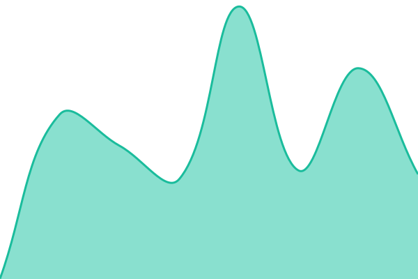

# [Live Status](https://status.samueljayasingh.in): <!--live status--> **🟩 All systems operational**

This repository contains the open-source uptime monitor and status page for [Samuel Jayasingh](https://samueljayasingh.in), powered by [Upptime](https://github.com/upptime/upptime).

With [Upptime](https://upptime.js.org), you can get your own unlimited and free uptime monitor and status page, powered entirely by a GitHub repository. We use [Issues](https://github.com/samueljayasingh/UptimeStatus/issues) as incident reports, [Actions](https://github.com/samueljayasingh/UptimeStatus/actions) as uptime monitors, and [Pages](https://status.samueljayasingh.in) for the status page.

<!--start: status pages-->
<!-- This summary is generated by Upptime (https://github.com/upptime/upptime) -->
<!-- Do not edit this manually, your changes will be overwritten -->
<!-- prettier-ignore -->
| URL | Status | History | Response Time | Uptime |
| --- | ------ | ------- | ------------- | ------ |
|  [Samuel Jayasingh (Portfolio)](https://samueljayasingh.in/) | 🟩 Up | [samuel-jayasingh-portfolio.yml](https://github.com/samueljayasingh/uptimeStatus/commits/HEAD/history/samuel-jayasingh-portfolio.yml) | 

 482ms
     
 | 

<a href="https://status.samueljayasingh.in/history/samuel-jayasingh-portfolio">100.00%</a>
    

|  [Samuel Jayasingh (Links)](https://links.samueljayasingh.in/) | 🟩 Up | [samuel-jayasingh-links.yml](https://github.com/samueljayasingh/uptimeStatus/commits/HEAD/history/samuel-jayasingh-links.yml) | 

 773ms
     
 | 

<a href="https://status.samueljayasingh.in/history/samuel-jayasingh-links">100.00%</a>
    

<!--end: status pages-->

[**Visit our status website →**](https://status.samueljayasingh.in)

## License

- Powered by: [Upptime](https://github.com/upptime/upptime)
